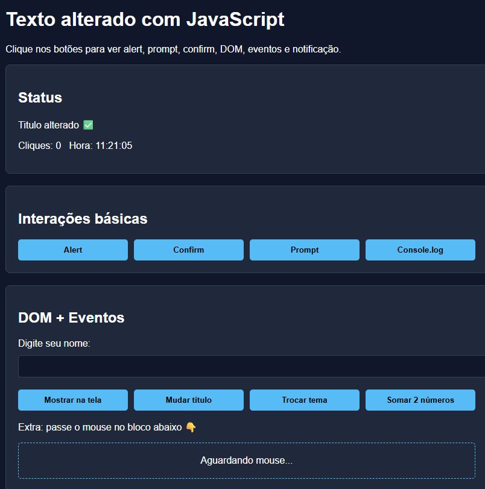
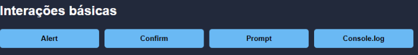
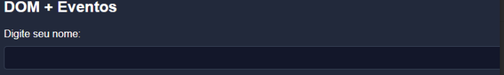
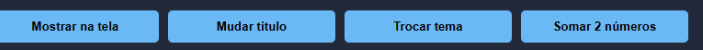

# 🚀 Projeto Showroom 
Este é um projeto interativo para demonstrar o uso de **JavaScript** na manipulação do DOM e eventos.

##💻 Tecnologias
* HTML5🌐
## O HTML foi utilizado para criar a base semântica do showroom.
* Organização: Uso de tags como <section> e 
 para separar os "cards" de interação
* Elementos de Interface: Criação de botões (<button>), campos de entrada (<input>) e áreas de exibição de texto.
* CSS3 🎨(Com suporte a Dark Mode)

## O CSS transforma a estrutura simples em uma interface moderna e agradável.
* Layout: Uso de Flexbox para centralizar o conteúdo e organizar os botões em grupos.
* Componentização: Estilização dos "Cards" com bordas arredondadas e sombras para dar profundidade.
* Temas: Criação de uma classe .dark-mode que altera as cores de fundo e texto dinamicamente.
* nteratividade Visual: Efeitos de hover nos botões para melhorar a experiência do usuário.
* JavaScript⚡
## O JavaScript é o responsável por dar vida à página, gerenciando todos os eventos.
* Manipulação do DOM: Alteração de textos (innerText) e títulos em tempo real
* Event Listeners: Funções que "escutam" quando o usuário clica em botões ou passa o mouse sobre elementos.
* Lógica de Dados: Cálculo de somas simples e gerenciamento de um contador de cliques.
* Bom/Window: Uso de métodos nativos do navegador como alert(), prompt() e confirm().
* Temporizadores: Implementação de um relógio que atualiza a cada segundo.

##🛠️ Funcionalidades 
* ✨**Interações Básicas:** Uso de 'alert' , 'prompt' e 'confirm'.

* ✨**DOM:** Alteração de textos , títulos e leituras de inputs.

* ✨**Eventos:** Contador de cliques, relógio em tempo real e eventos de mouse('hover').

* ✨**Tema:** Alternância entre tema claro e escuro.

## Como visualizar
📂 Basta abrir o arquivo 'index.html' em qualquer navegador.

